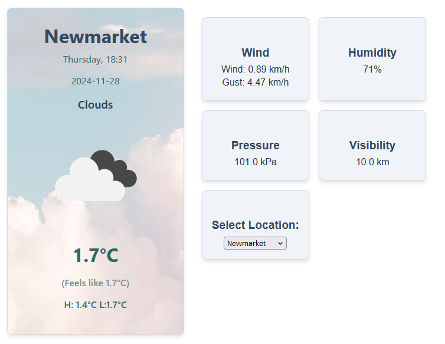
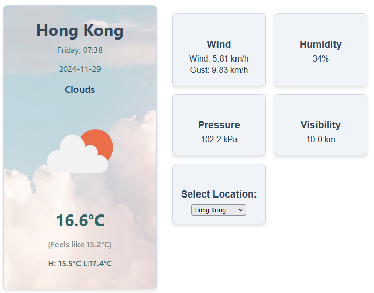

# COMP3123 - Lab Test 2
## Project Description
* Weather Information API: OpenWeather API
* Weather Icons: OpenWeather
* WeatherContext and useContext
    - WeatherContext fetches data on load
    - Default location: Toronto
    - On selecting new location, useEffect triggers data fetching again to update
    - wraps all components to provide unified source of truth
* Components
    - WeatherHome: main information (date, temp, current weather, icon)
    - WeatherExtra: extra information (humidity, pressure, visibility, wind)
    - LocationSelect: form to select a list of pre-defined locations (embedded in WeatherExtra)

## Screen shots

